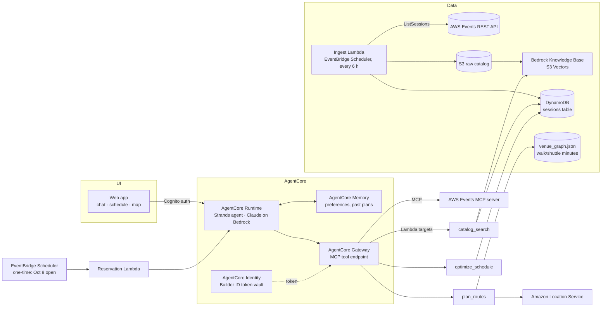

# re:Invent Planner Agent — Design (v0.1, awaiting approval)

One agent, three capabilities:

1. **Schedule Optimizer**: turns plain-language goals into a conflict-free schedule, then favorites and reserves sessions for you.
2. **Catalog RAG Q&A**: answers questions over the full session catalog (and last year's, for "what's new").
3. **Spatial layer**: groups the schedule by venue, adds walking and shuttle buffers, and draws the day on a map of the Las Vegas venues.

All three sit on the **AWS Events API** (REST and MCP server). The agent runs on **Amazon Bedrock AgentCore**.

---

## 1. What the AWS Events API gives us

Sources: the developer guide pages for ListEvents, ListSessions, GetSession, GetSchedule, AssociateFavorites, ReserveSessions and CreatePersonalTime. Our sandbox could not reach the docs or the OpenAPI spec (see §10), so this summary comes from search-indexed excerpts.

| Operation | Auth | Used for |
|---|---|---|
| `ListEvents` / `GetEvent` | none | Find the `eventId` for re:Invent 2026 (and 2025) |
| `ListSessions` (paginated, `nextToken`, `includeAbstracts`, `locale`) | Builder ID token (re:Invent requires registration) | Catalog ingest |
| `GetSession` | token | Fresh detail and fullness check just before reserving |
| `GetSchedule` | token | Your reservations, favorites and personal time, which the optimizer treats as constraints |
| `AssociateFavorites` (1 to 10 per call) | token | Auto-favorite |
| `ReserveSessions` | token | Auto-reserve. Opens through the API on **Oct 8, 2026** (Oct 6 in the web portal) |
| `CreatePersonalTime` | token | Block lunch, travel and meetings |

**Session fields:** `sessionId`, title, abstract, code, type, level, tracks, topics, industries, roles, services, start/end, **room and venue**, all-day flag, reservable flag, coarse fullness, and speakers.
→ Venue metadata exists, so feature #3 is feasible.

**MCP server:** exposes the same operations as tools. It requires sign-in on **every** call, including catalog reads.

Not yet verified (need the OpenAPI spec): the exact names of the remove-favorite and cancel-reservation operations, rate limits, token lifetime and refresh, and the batch size for `ReserveSessions`.

---

## 2. Architecture



### Why AgentCore rather than classic Bedrock Agents
- **MCP-native tools.** AgentCore Gateway serves our Lambda tools and the Events MCP server behind one MCP endpoint, which matches the "Bedrock agent + MCP" pitch.
- **AgentCore Identity** stores each user's Builder ID OAuth token. That makes an unattended reservation run at 9 AM on Oct 8 possible.
- **Runtime** hosts a Strands agent (Python), which gives full control of the reasoning loop. Classic action groups are more rigid.
- Fallback: if AgentCore is unavailable in the chosen region, the same Strands agent runs on Lambda with an MCP client.

---

## 3. Feature 1: Schedule Optimizer

The LLM should not solve the scheduling puzzle itself, because it is poor at combinatorial constraints. The work is split into four steps:

```
goals text ──► (1) Preference extraction (LLM → JSON constraints)
            ──► (2) Candidate retrieval (RAG + metadata filters, ~150 sessions)
            ──► (3) Relevance scoring (LLM, batched, cached per session+profile)
            ──► (4) CP-SAT solver (OR-Tools) → optimal schedule
            ──► (5) Explain + human approval ──► favorites / reserve / personal time
```

**(1) Constraint schema** (stored in AgentCore Memory, editable in the UI):
```json
{
  "interests": ["serverless", "event-driven", "Step Functions"],
  "levels": {"min": 300},                 // "avoid intro-level" → exclude 100/200
  "session_types": ["chalk talk", "workshop", "breakout"],
  "blocked": [{"daily": "12:00-13:00", "label": "Lunch"}],
  "max_walk_minutes_between": 15,
  "walk_weight": 0.6,                     // how strongly to penalise venue hops
  "days": ["2026-11-30", "..."],
  "max_sessions_per_day": 5,
  "must_include": [], "exclude": []
}
```
**Hard constraints:** no time overlap, blocked windows (lunch and existing `GetSchedule` personal time), and feasible travel. Travel is feasible when `end_i + travel(venue_i, venue_j) + buffer ≤ start_j`.
**Soft objective:** maximize `Σ relevance·x − λ·Σ travel_minutes − μ·venue_switches`, plus a small bonus for sessions that are less full (they are easier to get).

**(4) Solver:** OR-Tools CP-SAT with one boolean per candidate and pairwise conflict constraints. About 150 candidates × 5 days solves in under a second. It returns the **top plan plus ranked alternates** for each slot, which the reservation run uses when a session fills up.

**(5) Write actions, always with an approval gate:**
- The agent shows a diff (+ reserve, + favorite, + personal time). Nothing is written until you click **Approve**. The approved plan is saved in DynamoDB as `plan_version`.
- **Favorites:** `AssociateFavorites` in batches of 10. Allowed right away.
- **Personal time:** `CreatePersonalTime` for lunch and other blocks.
- **Reservations (Oct 8):** a one-time EventBridge Scheduler job fires at API open. The Lambda loads the approved plan, calls `GetSession` for freshness, then `ReserveSessions` in priority order. When a session is full it takes the next alternate that is still feasible, then re-runs the solver for the rest of the plan. It sends a summary email (SNS).

---

## 4. Feature 2: Catalog RAG Q&A

**Ingest (EventBridge, every 6 h, plus on demand):**
- Page through `ListSessions` for re:Invent 2026 and 2025 (if 2025 is still served), then write raw JSON to S3.
- Normalize into one document per session. The **abstract, title and speakers** are the text. **Level, type, tracks, services, day, venue and year** are metadata.
- Write to a **Bedrock Knowledge Base** backed by **S3 Vectors** (cheapest option at about 3–5k docs), using Titan Text Embeddings v2. Also upsert into DynamoDB for exact lookups and the solver.

**Query:**
1. The agent's `catalog_search(query, filters)` tool runs a KB retrieve with metadata filters. Example: "zero-ETL Aurora → Redshift" becomes semantic search filtered to `services ∋ Aurora|Redshift`.
2. A reranker (Bedrock Rerank, Cohere) narrows the results to the top 10.
3. Claude answers **with session codes cited**. Each code becomes a clickable card with "favorite" and "add to plan" buttons, which connects the Q&A back to the optimizer.

**"What's new vs last year":** retrieve from each year separately (`year` filter), then have the LLM compare the two sets and summarize new themes and services. If the API no longer serves 2025, a small one-off 2025 snapshot is loaded from public sources (open question Q4).

**Evaluation:** a gold set of about 30 questions with expected session codes, reporting recall@10. It runs in CI against fixture data.

---

## 5. Feature 3: Spatial layer

The catalog gives each session a venue and room. We add the geography.

- **`venue_graph.json`** (hand-curated, checked in): lat/lon for each re:Invent campus venue, plus a **walk-minute matrix and shuttle-minute matrix** between them. Values are seeded from Amazon Location `CalculateRouteMatrix` (walking) and then corrected by hand for indoor routes (casino walks are longer than the straight line suggests). It also holds room → floor/zone offsets for each venue (e.g., "Venetian Level 5" = +5 min from lobby).
- **`plan_routes(schedule)`** returns for each day an ordered itinerary with *leave-by* times, walk or shuttle mode, and buffer slack. Transitions are flagged **green/amber/red**, where red means slack below 5 min. The solver uses the same matrix, so the plan and the route never disagree.
- **Clustering:** a soft objective term ("stay on one campus per half-day") makes days naturally cluster by venue. The UI shows the resulting "home venue" for each block.
- **Map:** MapLibre GL with an Amazon Location Service basemap. It shows venue pins numbered in session order, a route polyline, and a timeline scrubber. Indoor floor maps are out of scope for v1 (licensing); floor is shown as text.

---

## 6. Agent design

- **Model:** Claude on Bedrock, the latest Sonnet-class model for the conversation loop. A Haiku-class model does bulk relevance scoring, for cost.
- **Framework:** Strands Agents (Python) on AgentCore Runtime.
- **Tools the agent sees:**

| Tool | Source |
|---|---|
| `catalog_search`, `get_session_details` | Lambda (KB + DDB) |
| `get_my_schedule`, `add_favorites`, `reserve_sessions`, `add_personal_time` | Events MCP server via Gateway |
| `update_preferences`, `optimize_schedule`, `plan_routes`, `propose_plan`, `approve_plan` | Lambda |

- **Guardrails:** write tools reject calls without a current `approved_plan_id`, so the model cannot reserve on its own initiative. A Bedrock Guardrail filters topics and PII.
- **Memory:** short-term memory holds the conversation. Long-term memory holds preferences and past plans, so "re-plan Tuesday, I have a customer meeting 2–3" works.

## 7. UI

For v1, a single-page **React + Vite** app on **Amplify Hosting** with Cognito sign-in and a "Connect AWS Builder ID" OAuth button. It has three panes: **Chat**, **Schedule** (week grid showing reserved, favorite and personal time), and **Map**. It streams from the AgentCore Runtime endpoint.
A **CLI** (`reinvent-agent chat`) is also provided for fast development and demos.

## 8. Repo layout & tooling

```
infra/            CDK (Python) stacks: data, agent, api, web, scheduler
agent/            Strands agent, prompts, tool schemas
tools/            Lambda tools: catalog_search, optimizer (OR-Tools), routes
ingest/           ListSessions paginator, normalizer, KB sync
spatial/          venue_graph.json + builder script (Location Service)
web/              React app (chat, schedule grid, MapLibre map)
tests/            unit + fixture-based integration + RAG eval
fixtures/         recorded API responses (sanitized)
```
Python 3.12, uv, ruff and pytest, with GitHub Actions CI running lint, tests and `cdk synth`.

## 9. Delivery plan (reservation opens via API **Oct 8**)

| Milestone | Target | Scope |
|---|---|---|
| M0 | Sep 28 | Repo skeleton, CDK base, Events API client + fixtures, Builder ID auth spike |
| M1 | Oct 2 | Ingest → KB + DDB, `catalog_search`, CLI Q&A, RAG eval |
| M2 | Oct 6 | Preferences, scoring, CP-SAT optimizer, approval flow, favorites + personal time |
| M3 | **Oct 7** | Reservation Lambda + one-time schedule, dry-run against staging/fixtures |
| M4 | Oct 14 | Venue graph, `plan_routes`, map UI |
| M5 | Oct 21 | Web UI polish, "what's new vs 2025", demo script |

## 10. Risks & open questions (need your input)

| # | Question / risk | My proposal |
|---|---|---|
| Q1 | **Unattended auth:** can a Builder ID token (or its refresh token) be stored and used at 9 AM Oct 8 without you present? | Spike in M0. If it can't, fall back to a push notification plus one-tap "Run reservations now". |
| Q2 | **ToS / fairness** of automated reservation | Only reserve your approved plan, for your own account, at human-like pace (no hammering). Respect rate limits. |
| Q3 | **Network access:** this cloud sandbox is blocked from `docs.aws.amazon.com` and `api.awsevents.com` | Allow both hosts in the environment's network policy, or commit the OpenAPI spec to the repo. Until then I'll build against recorded fixtures. |
| Q4 | Is re:Invent 2025's catalog still served, for "what's new"? | Check in M0. If not, use a static snapshot. |
| Q5 | AWS account and region for deployment | `us-east-1` or `us-west-2` (AgentCore + S3 Vectors availability). Which account? |
| Q6 | UI scope: full React web app, or CLI + Streamlit for a hackathon-speed demo? | React (above). Tell me if you'd rather go faster with Streamlit. |
| Q7 | Vector store: S3 Vectors (cheap, simple) vs OpenSearch Serverless (hybrid keyword + vector, about $350/mo floor) | S3 Vectors + reranker |

**Rough cost** (for one user, during the conference window): under $30/month. Most of it is Bedrock tokens. S3 Vectors, DynamoDB, Lambda and Location Service are pennies at this scale.
